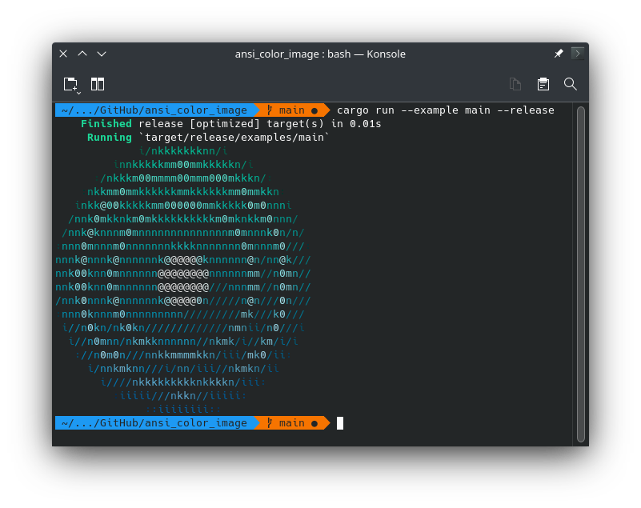
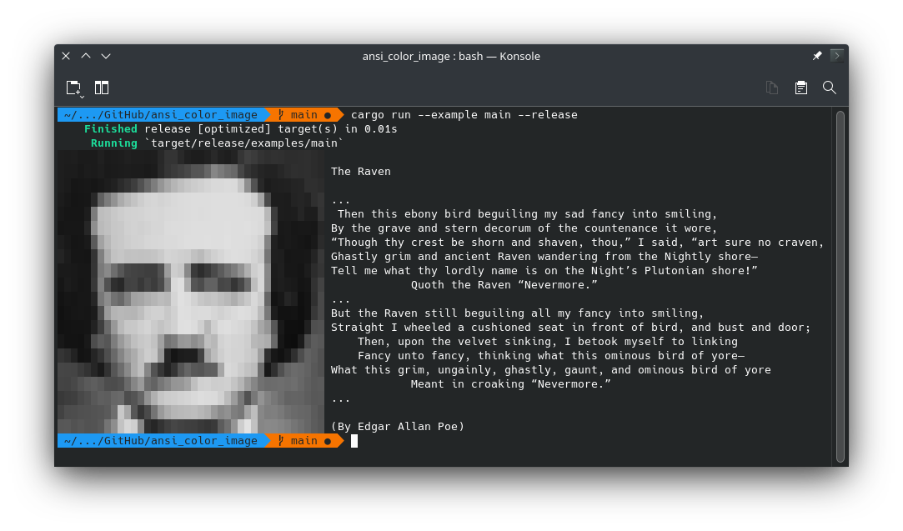

## ansi_color_image

Lib to create figures with text characters and ANSI colors from an image file.

https://github.com/w-a-gomes/ansi_color_image

Example:

```rust
use ansi_color_image as aci;

fn main() {
    let mut img = aci::ImageColorMap::new("examples/data/neon.png");
    img.dimensions(40, 20);                   // Width and height.
    img.filter(20.0, -15);                    // Contrast and brightness.
                                              //
    for pixel_line in img.build_pixel_map() { // pixel_line = [pixel, pixel, pixel]
        println!("{}", pixel_line);           // pixel = "\x1b[38;2;0;0;0m*"
    }
}
```


Each vector represents a line, making it easier to place parallel information.

```rust
let poem = "
The Raven

...
 Then this ebony bird beguiling my sad fancy into smiling,
By the grave and stern decorum of the countenance it wore,
“Though thy crest be shorn and shaven, thou,” I said, “art sure no craven,
Ghastly grim and ancient Raven wandering from the Nightly shore—
Tell me what thy lordly name is on the Night’s Plutonian shore!”
            Quoth the Raven “Nevermore.”
...
But the Raven still beguiling all my fancy into smiling,
Straight I wheeled a cushioned seat in front of bird, and bust and door;
    Then, upon the velvet sinking, I betook myself to linking
    Fancy unto fancy, thinking what this ominous bird of yore—
What this grim, ungainly, ghastly, gaunt, and ominous bird of yore
            Meant in croaking “Nevermore.”
...

(By Edgar Allan Poe)";
let mut img = aci::ImageColorMap::new("examples/data/poe.png");
img.show_background_color(true);
img.hide_foreground_character(true);

for (pixel_line, poem_line) in img.build_pixel_map().iter().zip(poem.split("\n")) {
    // IMAGE:
    print!("{}", pixel_line);  // Print without newline.
    // POEM:
    println!(" {}", poem_line);
}
```

